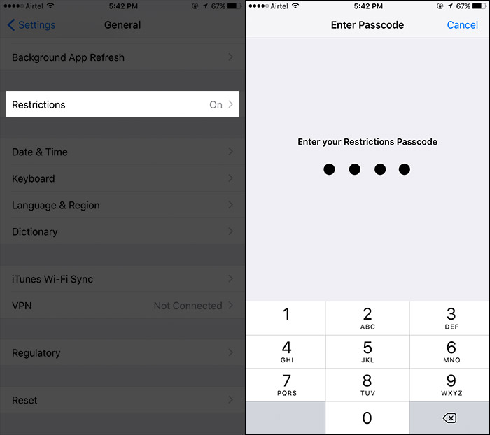

# iOS Restriction Passcode Brute Force 

[](https://www.python.org/downloads/release/python-2714/)   [](http://makeapullrequest.com) [](https://codeclimate.com/github/thehappydinoa/iOSRestrictionBruteForce)

## Overview

This version of the application is written in Python, which is used to crack the restriction passcode of an iPhone/iPad takes advantage of a flaw in unencrypted backups allowing the hash and salt to be discovered.



## DEPENDENCIES

This has been tested with [Python 2.7](https://www.python.org/downloads/release/python-271/) and [Python 3.6](https://www.python.org/downloads/release/python-365/)

Requires [Passlib](https://passlib.readthedocs.io/en/stable/) Install with `pip install passlib`

## Usage

    usage: iOSCrack.py [-h] [-a] [-c] [-b folder] [-t]

    a script to crack the restriction passcode of an iDevice

    optional arguments:
    -h, --help            show this help message and exit
    -a, --automatically   automatically finds and cracks hashes
    -c, --cli             prompts user for input
    -b folder, --backup folder
                        where backups are located
    -t, --test            runs unittest

## How to Use

1.  Clone repository

    ```bash
     git clone https://github.com/thehappydinoa/iOSRestrictionBruteForce && cd iOSRestrictionBruteForce
    ```

2.  Make sure to use [iTunes](https://www.apple.com/itunes/download/) or [libimobiledevice](https://github.com/libimobiledevice/libimobiledevice) to backup the iOS device to computer

3.  Run `ioscrack.py` with the auto option

         python ioscrack.py -a


## How to Test

Run `ioscrack.py` with the test option

         python ioscrack.py -t

## How It Works

Done by using the [pbkdf2](http://www.ietf.org/rfc/rfc2898.txt) hash with the Passlib python module

1.  Trys the [top 20 four-digit](http://www.datagenetics.com/blog/september32012/index.html) pins

2.  Trys birthdays between 1900-2017

3.  Brute force pins from 1 to 9999

4.  Adds successful pins to local database

## How to Protect Against

1.  Encrpyt backups

2.  Backup only on trusted computers

## Contributing

Best ways to contribute

-   Star it on GitHub - if you use it and like it please at least star it :)
-   [Promote](#promotion)
-   Open [issues](https://github.com/thehappydinoa/iOSRestrictionBruteForce/issues)
-   Submit fixes and/or improvements with [Pull Requests](http://makeapullrequest.com)

## Promotion

Like the project? Please support to ensure continued development going forward:

-   Star this repo on [GitHub](action:files#disambiguate)
-   Follow me

    -   [Twitter](https://twitter.com/thehappydinoa)
    -   [GitHub](https://github.com/thehappydinoa)

## Acknowledgments

-   [yuejd](https://github.com/yuejd)

## LICENSE

[MIT License](LICENSE)
